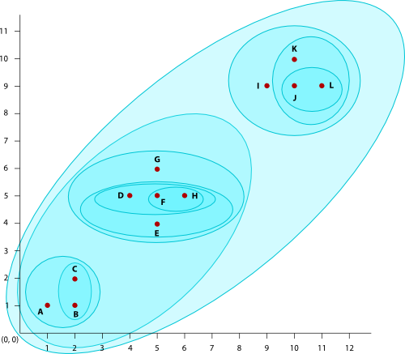
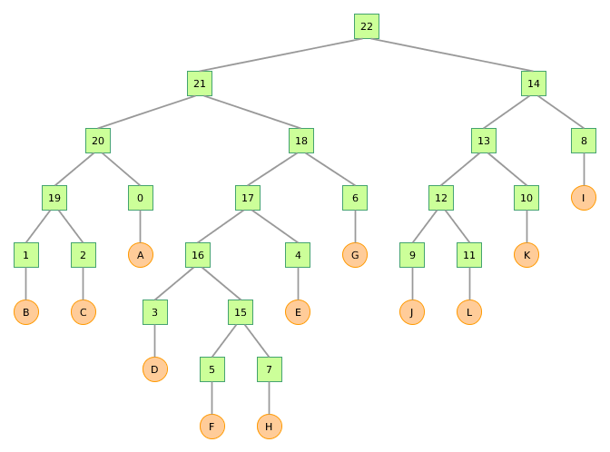

# Hierarchical Agglomerative Clustering

Implements the
[Hierarchical Agglomerative Clustering](http://en.wikipedia.org/wiki/Hierarchical_clustering)
algorithm.

## Usage

To run the clustering program, you need to supply the following
parameters on the command line:

* Input file that contains the items to be clustered.
* Number of disjointed clusters that we wish to extract.
* _Linkage criteria_ to use when calculating the _distance metric_.

    * `s` - Single linkage (default)
    * `c` - Complete linkage
    * `a` - Average linkage

For instance, the following is an example run:

    $ ./agglomerate example.txt 3 s

In this example, we are running the hierarchical agglomerative
clustering on the items in the input file `example.txt`. We are asking
the program to generate `3` disjointed clusters using the
_single-linkage_ distance metric.

### The input file

The input file contains the items to be clustered.

    <number of items to cluster>
    <label string>| <x-axis value> <y-axis value>
    ...

For instance, the following is a valid input. It contains 12 data
points, where each data point is referred to by its label and has
coordinates in the two-dimensional [Euclidean
plane](http://en.wikipedia.org/wiki/Euclidean_plane). Note that we can
adapt this input format to accommodate \\\(n\\\)-dimensional vectors.

    12
    A| 1.0 1.0
    B| 2.0 1.0
    C| 2.0 2.0
    D| 4.0 5.0
    E| 5.0 4.0
    F| 5.0 5.0
    G| 5.0 6.0
    H| 6.0 5.0
    I| 9.0 9.0
    J| 10.0 9.0
    K| 10.0 10.0
    L| 11.0 9.0

After running the clustering algorithm, we get the following hierarchy:

The cluster hierarchy may be represented by the binary tree:

For further details, please visit my
[homepage](http://yaikhom.com/2014/08/21/hierarchical-agglomerative-clustering.html).
